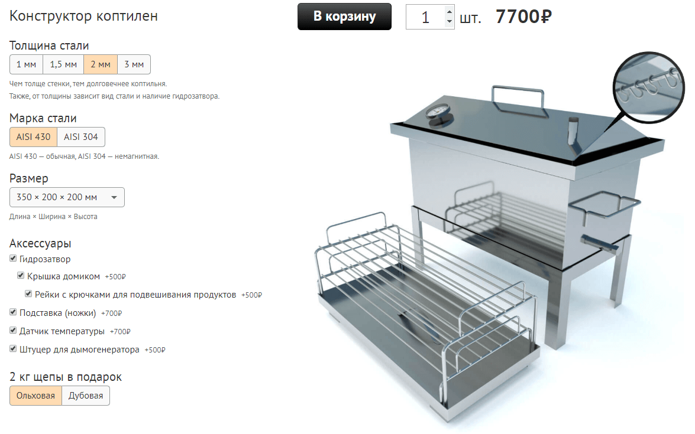

# Конструктор коптилен
Для интернет-магазина [ПрофКоптильня](https://profkoptilnya.ru)



- Цена за штуку
- Кол-во
- Общая цена = цена за штуку * кол-во
- Толщина стали
- Марка стали
- Размеры
- Гидрозатвор
- Крышка домиком
- Рейки с крючками для подвешивания продуктов
- Подставка (ножки)
- Датчик температуры
- Штуцер для дымогенератора
- Щепа в подарок


# Компоненты
- App
  - Price
  - View
  - Form


## Price
Расчет цены и добавление в корзину

## View
Отображение коптильни

## Form
Изменение параметров коптильни по определенным правилам.

### Толщина стали
- **0** - 1 мм
- **1** - 1.5 мм
- **2** - 2 мм
- **3** - 3 мм

### Марка стали
AISI 304 может быть только 2 и 3 мм.
- **0** - AISI 304
- **1** - AISI 430

### Размер
Список доступных размеров зависит от толщины стали, марки стали и наличия гидрозатвора.

Списки лежат в объекте "sizes", где ключи это строка из трех цифр: XYZ, где X — толщина стали, Y — наличие гидрозатвора, Z — марка стали.
Например, 111 - 1.5 мм, с гидрозатвором, сталь 430

### Аксессуары
Толщина 1 и 1.5 мм только с гидрозатвором.
- Гидрозатвор
  - Крышка домиком
    - Рейки с крючками для подвешивания продуктов
- Подставка (ножки)
- Датчик температуры
- Штуцер для дымогенератора


# Пример состояния приложения
```js
{
  view: {
    image: '',
    hook: ''
  },
  price: {
    price: 2500,
    total: 2500,
    quantity: 1
  },
  form: {
    sizes: {
      "111": [
        {
            name: "350 × 200 × 200 мм",
            price: 3680,
            value: 1099
        }
      ],
    },
    size: 0,
    thickness: 0,
    steel: 0,
    waterlock: 0,
    cover: 0,
    hooks: 0,
    stand: 0,
    thermometer: 0,
    fitting: 0
  }
}
```


# Действия
TODO: Описать все действия
