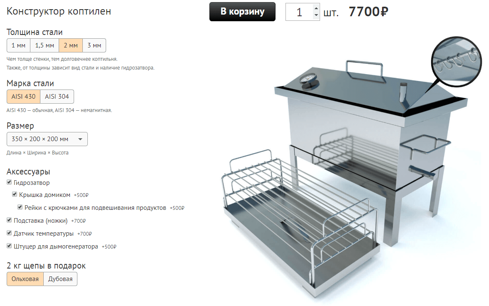

# Конструктор коптилен

Для интернет-магазина [ПрофКоптильня](https://profkoptilnya.ru)\
[Посмотреть на сайте](https://profkoptilnya.ru/constructor)

Встраивается в OpenCart.\
Написан на React + Redux. Сборка через Webpack.




## Команды

### `build`
Собирает исходный код в единственный js-файл, берет изображения из папки static и кладет их в папку dist.
```sh
npm run build
# webpack --config=webpack.config.base.js
```

### `dev`
Запускает локальный сервер. Стили максимально приближены к сайту. Доступен по адресу `localhost:9000`.
```sh
npm run dev
# webpack-dev-server --config=webpack.config.dev.js
```
